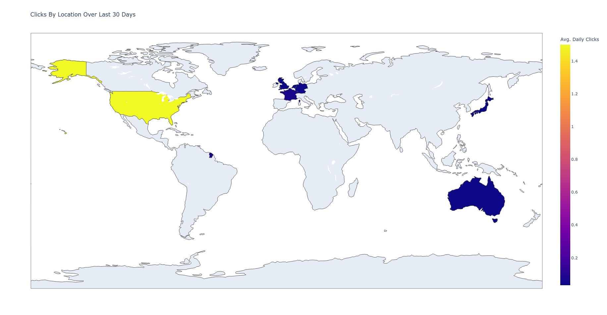

[](https://github.com/pbierkortte/Example-Data-Driven-Webapp/actions/workflows/python-test.yml)
<a href="https://trackgit.com">

</a>


# Example Data-driven Webapp


## Problem
* Create a web app that consumes Bitly's API and present the results in an easy-to-understand way[^1]

## Solution
### API
#### avgDailyClicksByCountry
* For a user's default group:
  * Gather all the Bitlinks
  * Fetch the clicks by country within the last 30 days
  * Aggregate the data calculating the average days as clicks/30
  * Return the result via an HTTP API endpoint

### Visualization
#### Clicks By Location
* Present the data from the avgDailyClicksByCountry API as a world map


## Assumptions
* You have some knowledge of
  * Python
  * Linux/macOS
* Your computer runs Linux/macOS
* Your computer is connected to the internet
* You have a Bitly Access Token
  * To make use of our API, you will need a Bitly Access Token
    1. Sign up for a Bitly account if you do not already have one
    2. Visit [this page](https://bitly.is/accesstoken) to get your Access Token.
* You have Python v3.10+ installed
  * To check run the following, and verify
```bash
python3 --version
```

## Major Design Decisions
* Python
  * Simple
  * Powerful
* Flask Framework
  * Near-zero setup
  * For production, Flask can easily be swapped for [Gunicorn](https://gunicorn.org/)
* Security
  * Bitly API Token provided to the app via an environment variable
* Testability
  * Used Github Actions to run tests on each push to the default branch


## Requirement Checklist
* [x] Runs
* [x] Tests
* [x] Maps
* [x] Docs
* [x] **FUN!**


## Dependencies
### Python
* flask
  * HTTP server  
* pandas
  * Data wrangling 
* unittest
  * Testing 
* plotly
  *  Graphing library
* pycountry
  * Convert ISO country codes 
* others[^2]


## Setup
Run the following commands from the terminal

### Create a virtual environment 
```bash
python3 -m venv venv
```

### Activate the virtual environment
```bash
source venv/bin/activate
```

### Install required packages
```bash
pip install -r requirements.txt
```

### Set environment variable
#### Bitly API Token
```bash
export BITLY_API_TOKEN=<Your token here>
```


## Testing
```bash
python3 -m unittest
```
1. Run the command above from the terminal


## Execute
```bash
flask run
```
1. Run the command above from the terminal
2. Click on the link displayed in the terminal
   * A new tab will open in your browser
   * Usually, the URL will be [http://127.0.0.1:5000/](http://127.0.0.1:5000/)
3. Switch back to the terminal and press CTRL+C to quit


## Optional

### Refreshing the test data
* Fake data was provided for testing 
* You can generate new test data with the provided [refresh_test_data.py](refresh_test_data.py) utility
  * It uses a spy pattern to collect actual requests & responses
* If you have not done so already, run the setup steps shown above
* Then, run the commands below
```bash
python3 refresh_test_data.py
```


[^1]: Extends this [Bitly API interview coding challenge](https://git.io/JSba4). Archive link https://archive.is/xl5S7. Backup fork https://git.io/JSbuY

[^2]: The full list can be found in the [requirements file](requirements.txt)

